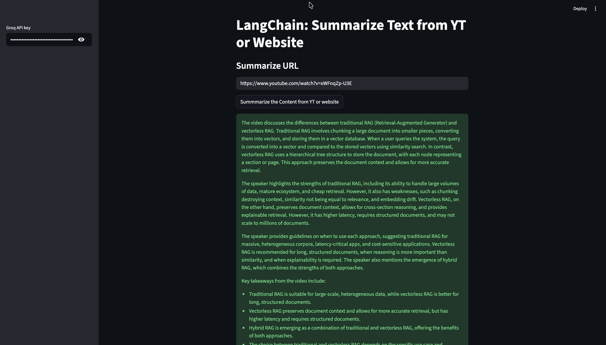

# AI Text Summarizer using LangChain & Groq

An AI-powered text summarization application built using Streamlit, LangChain, and Groq LLMs.  
The application can summarize content from:

- YouTube videos
- Website URLs

The app extracts the content, processes it using LangChain document loaders, and generates concise summaries using Groq-hosted LLMs.

---

## Features

- Summarize YouTube video transcripts
- Summarize website articles and blogs
- Fast inference using Groq LLMs
- Streamlit-based interactive UI
- URL validation
- Supports long content summarization using LangChain `stuff` chain

---

## Tech Stack

- Python
- Streamlit
- LangChain
- Groq API
- YouTube Transcript API
- Validators

---

## Installation

### 1. Clone the repository

```bash
git clone https://github.com/charrann12/YT_or_Website_URL_Summarizer.git
```

### 2. Create virtual environment

```bash
python -m venv venv
```


## Run the Application

```bash
streamlit run app.py
```

---

## Usage

1. Enter your Groq API key in the sidebar
2. Paste a YouTube URL or website URL
3. Click on **Summarize**
4. Get an AI-generated summary instantly

---

## Supported Models

Example model used:

```python
llama-3.3-70b-versatile
```

You can also use:
- `llama-4-scout-17b-16e-instruct`
- `llama-4-maverick-17b-128e-instruct`

---

## Screenshots



---
